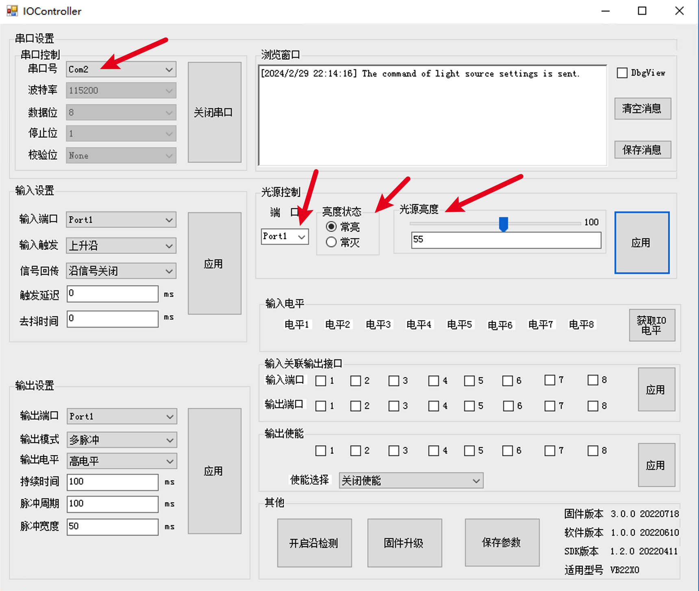
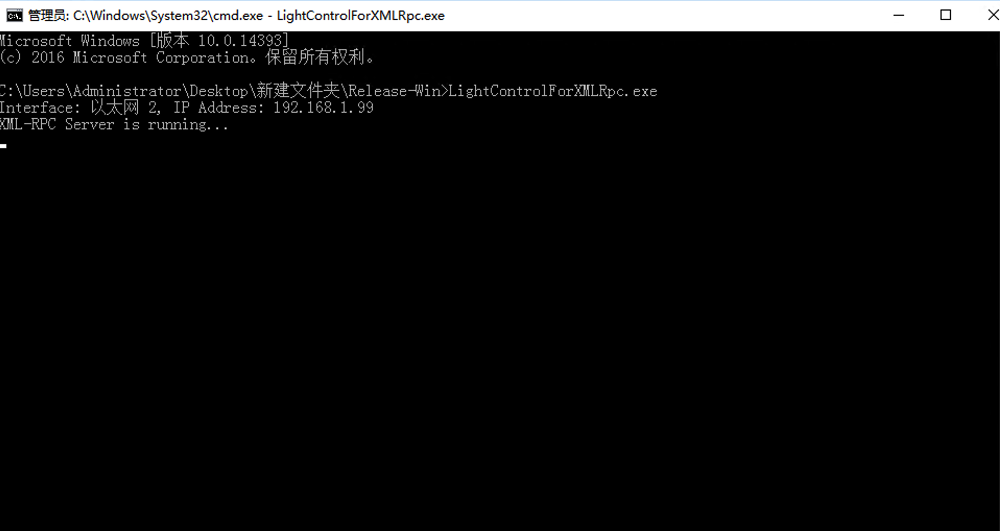
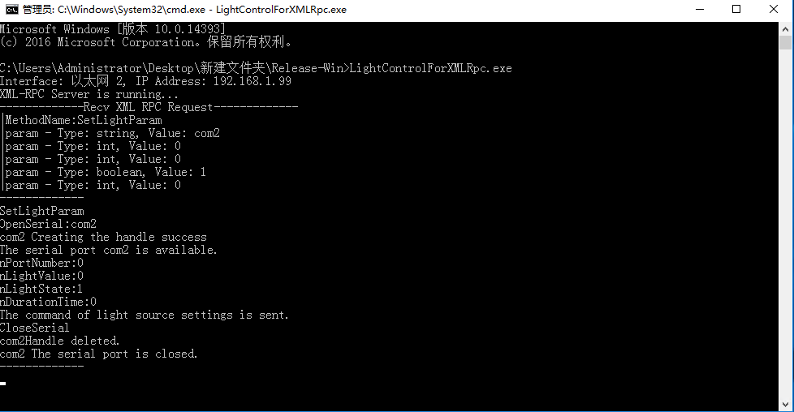

## LightControllForXmlRpc

在使用Hik VB2200视觉控制器时，由于并未使用VisionMaster软件，但是使用了视觉控制器的光源接口。导致无法直接控制该光源接口。

VB2200视觉控制器提供了一个IOController应用程序，其中对应的exe文件可以设置为对应光源接口的亮度等参数，基本满足需求。但是IOController只能设置对应的参数，当我们用该控制器时一般都是跑一些自动化程序，并不能每次都来点击IOController的界面来实现光源的控制。

LightControllForXmlRpc基于XMLRPC请求，封装了设置光源亮度的接口.

### 功能

基于.net5.0提供x64位的xmlrpc光源控制程序。

该程序会根据控制器的所有网卡的地址上创建XMLRPC 服务器并监听，

```tex
├─.vscode
├─runtime						# .net5.0运行时
├─lib							# Hik提供的X64位dll
├─src
  ├─IOControllSDK.cs			# 控制器SDK接口
├─Main.cs						# XMLRPC实现&设置光源接口
```

#### XMLRPC方法

```
XMLRpc Request port：9090
MethodName：SetLightParam
Param: serialName string 串口号
Param: serialName int    端口号（port1对应0，port2对应1 ... ）
Param: serialName int    光源亮度
Param: serialName bool   是否常亮
Param: serialName int    持续时间

上述参数均可通过IOController测试获取
```



### 如何安装使用

1. 下载Release Package，解压得到

   ```
   ├─LightControlForXMLRpc.deps.json
   ├─LightControlForXMLRpc.dll
   ├─LightControlForXMLRpc.exe
   ├─LightControlForXMLRpc.pdb
   ├─LightControlForXMLRpc.runtimeconfig.json
   ├─MvIOInterfaceBox.dll
   ├─MvIOInterfaceBox.pdb
   ├─MvSerial.dll
   ```

2.  以管理员权限运行cmd，并且运行LightControlForXMLRpc.exe

   

3. XMLRPC请求测试

### 测试

测试Python版本3.7

```python
import xmlrpc.client
import time

# XML-RPC服务器的地址和端口
server_url = 'http://your_url:9090'

# 创建一个XML-RPC客户端代理
proxy = xmlrpc.client.ServerProxy(server_url)

value = 0
while 1:
    
    time.sleep(1)
    # 发送XML-RPC请求并接收响应
    result = proxy.SetLightParam("com2",0,value,True,0)

    # 打印响应结果
    print(f"SetLightParam|LightValue:{value}")
    print("value", value)
    value += 10
    if value >= 100:
        value = 0
```

### Tips:

实际使用过程中建议将该exe封装为Windows服务，并且重定向输出使用

推荐NSSM软件，详细使用方法，微信搜索 NSSM最详细解说